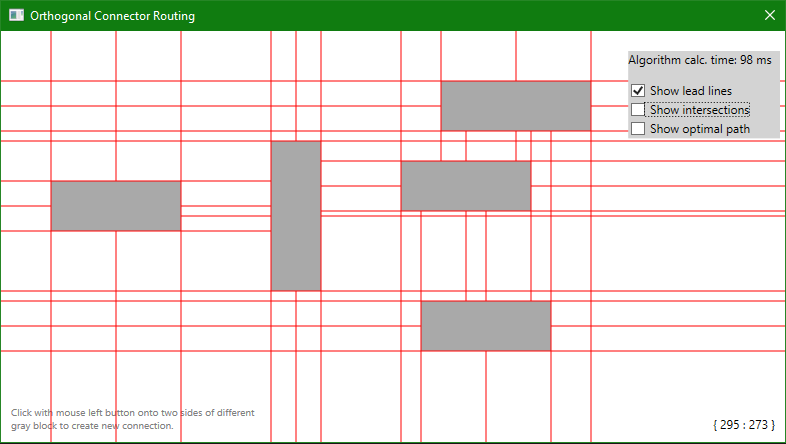
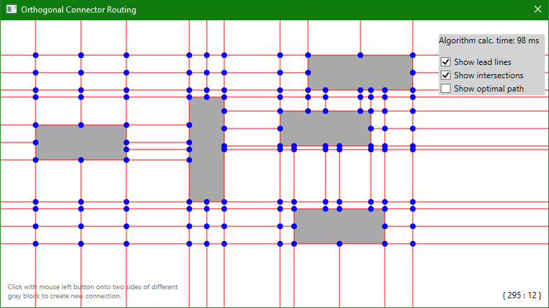
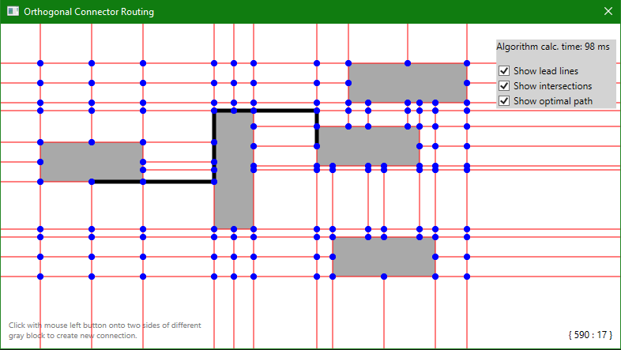
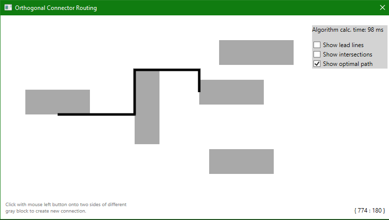

# Orthogonal Connector Routing

 

Orthogonal connectors are used in a variety of common diagrams. 
Most interactive diagram editors provide orthogonal connectors with some form of automatic connector routing.

## Algorithm

This project is a prototype (or proof of concept) of such automatic connector routing.
Orthogonal connector routing library computes optimal route between two objects while avoiding 
collisions with other objects.

The algorithm uses graph structure build on top of the BST (binary search tree), 
so all calculations are fast and efficient, allowing real-time rerouting during the interaction.

## Pathfinding

Each route between two objects starts and ends on one of the centers of the sides. One side can lead to multiple
objects, but the center point can't be moved.

Pathfinding algorithm can be selected using a generic interface `ISearchAlgorithm`.

Currently, the only type of pathfinding algorithm is implemented - Dijkstra's algorithm. 
This algorithm isn't the best, it simply calculates the shortest route between objects. 
Unfortunately, the shortest path isn't always "the best" or optimal path. Such an issue will solve
A* heuristic algorithm (not implemented yet).

## How it works

First of all, the algorithm generates lead lines. These lines are parallel lines that start at each side of the object and in each object's center.
In that case, each object will create 8 lines (4 sides and 4 centers). Each line is drawn across the canvas, in both directions
until it hits some kind of collision (other object or end of the canvas). These will become the graph's edges.

Then intersections are created. The intersection is made when two lines intersect one another at some point.
Intersections will become the graph's nodes.

After this, the final graph can be constructed. Nodes don't have any weight or value but edges do.
Edge value/weight is calculated by the distance between nodes (in pixels). The longer the distance, the higher value.

Now it can be fully used to find new paths between objects.

## Example

Sample App in this project contains some visual examples of how the structure is generated,
how the path is found and shows how each object is linked together.